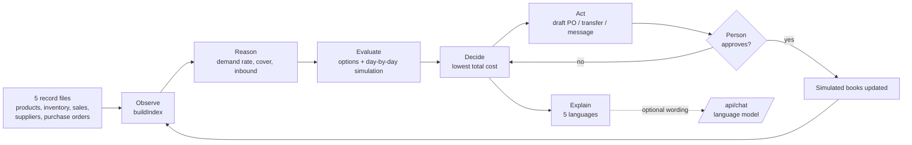

# Kaveri Desk

An AI purchasing colleague for **Kaveri Spares & Hydraulics** (Cypher 2026, Challenge 01: The Spare Parts Desk).

Every morning it answers Ramesh's question, *"What supply-chain problems need my attention today, and what should I do about them?"*, with the three things that matter and a draft ready to approve.

**Our agent decides** which shelf to refill, from where, and at what cost, and drafts the PO, transfer or message for a person to approve.

## What it does

| Step | What happens | Where |
| --- | --- | --- |
| Observe | Reads products, inventory, sales, suppliers and purchase orders | `lib/engine.ts` `buildIndex` |
| Reason | Works out daily demand, days of cover, what is inbound and what is late | `lib/engine.ts` `position` logic |
| Evaluate | Builds every workable option and simulates each one day by day | `shortageOptions`, `simulate` |
| Decide | Picks the lowest total rupee cost (lost sales + transport + higher price + carrying cost) | `pickBest` |
| Act | Drafts a purchase order, transfer request, supplier enquiry or store alert | `ActionDraft` |
| Explain | Shows the numbers and the reason every other option lost | `lib/present.ts` |

Nothing is ordered, moved or sent until a person presses **Approve**. Rejecting a pick makes the desk offer the next best option.

### Problems it spots

1. Parts that will run out before any supplier can deliver
2. Slow-moving stock tying up cash
3. Purchase orders that are overdue and putting stock at risk
4. Suppliers whose price, lead time or MOQ make them the wrong choice
5. Demand that suddenly jumped or dropped at one location

### What makes it different

- **Five languages.** English, Hindi, Kannada, Tamil and Telugu for the whole screen.
- **Messages in the recipient's language.** Ramesh reads English; the Coimbatore supplier gets the PO in Tamil, the Hyderabad supplier in Telugu, the Gokak store in Kannada. One tap opens it in WhatsApp.
- **It connects problems.** Gokak is running out of a filter that Belgaum is sitting on: one transfer fixes both.
- **It knows when not to act.** A sales jump with 27 days of stock gets a question to the store, not a purchase.
- **Try a surprise.** The Data screen lets anyone change stock, demand, prices, lead times or orders, or upload their own CSVs, and the desk works everything out again.
- **No black box.** Every decision is arithmetic you can read. A language model is optional and only rewords chat answers; it never produces a number.

## Run it

```bash
npm install
npm run dev      # http://localhost:3000
npm test         # 14 tests, including the brief's own Gokak example
```

Docker: `docker build -t kaveri-desk . && docker run -p 3000:3000 kaveri-desk`

## Deploy

Import this repository at [vercel.com/new](https://vercel.com/new) and press Deploy; no settings are needed. Every push to `main` then redeploys automatically. `/api/health` is the health check.

To let a language model reword chat answers, add `ANTHROPIC_API_KEY` or `GEMINI_API_KEY` in the host's environment settings (see `.env.example`). Without a key the chat answers from the same calculations.

## Architecture



- `lib/engine.ts`: the agent. Pure functions, no network, fully tested.
- `lib/present.ts`, `lib/i18n/`: turn numbers and reason codes into sentences.
- `lib/chat.ts`: answers questions from the records; says so when it has no data.
- `components/`: the screens (Next.js App Router, plain CSS, no UI library).
- `app/api/chat`: optional language-model wording. Keys stay on the server.

## Assumptions, stated openly

The five files do not contain margins, transport costs or carrying costs, so the desk uses the values on **Data > Assumptions** (25% margin, a lost sale costs twice its margin, 18% a year to hold stock, ₹16/km transport, 30 days of cover per reorder). Change them and every recommendation updates.

Sample data is fictional and rebuilt relative to today's date. Purchase orders carry an optional `location` column; without it an order is assumed to go to Hubli Warehouse.

The Hindi, Kannada, Tamil and Telugu text should be read once by a native speaker before a real rollout.
