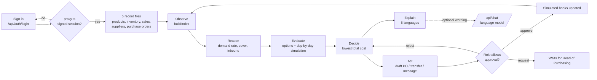

# Kaveri Desk

An AI purchasing colleague for **Kaveri Spares & Hydraulics** (Cypher 2026, Challenge 01: The Spare Parts Desk).

Every morning it answers the purchasing head's question, *"What supply-chain problems need my attention today, and what should I do about them?"*, with the three things that matter and a draft ready to approve.

**Our agent decides** which shelf to refill, from where, and at what cost, and drafts the PO, transfer or message for a person to approve.

## Sign in

Open the app and pick a demo account on the sign-in screen; it fills the form for you.

| Who | ID | Password | Can do |
| --- | --- | --- | --- |
| Ramesh Kulkarni, Head of Purchasing | `ramesh` | `kaveri@2026` | Approves orders, transfers and messages. **Start here.** |
| Savitha Hiremath, Store manager, Gokak | `savitha` | `gokak@2026` | Approves stock moves for Gokak. Purchase orders go to Ramesh as a request. |
| Neha Desai, Finance and audit | `auditor` | `audit@2026` | Sees everything, approves nothing, cannot edit records. |

Try the hand-off: sign in as Savitha, open the Haveri hydraulic-oil problem, press **Send to Head of Purchasing**, sign out, sign in as Ramesh and the request is waiting on the Today screen.

## What it does

| Step | What happens | Where |
| --- | --- | --- |
| Observe | Reads products, inventory, sales, suppliers and purchase orders | `lib/engine.ts` `buildIndex` |
| Reason | Works out daily demand, days of cover, what is inbound and what is late | `lib/engine.ts` `position` logic |
| Evaluate | Builds every workable option and simulates each one day by day | `shortageOptions`, `simulate` |
| Decide | Picks the lowest total rupee cost (lost sales + transport + higher price + carrying cost) | `pickBest` |
| Act | Drafts a purchase order, transfer request, supplier enquiry or store alert | `ActionDraft` |
| Explain | Shows the numbers and the reason every other option lost | `lib/present.ts` |

Nothing is ordered, moved or sent until a person with the right role presses **Approve**. Rejecting a pick makes the desk offer the next best option.

### Problems it spots

1. Parts that will run out before any supplier can deliver
2. Slow-moving stock tying up cash
3. Purchase orders that are overdue and putting stock at risk
4. Suppliers whose price, lead time or MOQ make them the wrong choice
5. Demand that suddenly jumped or dropped at one location

### What makes it different

- **Approval follows authority.** A store manager can move stock in or out of their store but cannot commit company cash; a purchase order becomes a request to the Head of Purchasing. Every decision records who made it.
- **Network pulse.** A live map of the six stores and two warehouses, coloured by urgency, with the transfers the desk is proposing drawn between them. Click a town to see its problems.
- **Five languages.** English, Hindi, Kannada, Tamil and Telugu for the whole screen, including the sign-in page.
- **Messages in the recipient's language.** The Coimbatore supplier gets the PO in Tamil, the Hyderabad supplier in Telugu, the Gokak store in Kannada. One tap opens it in WhatsApp.
- **It connects problems.** Gokak is running out of a filter that Belgaum is sitting on: one transfer fixes both.
- **It knows when not to act.** A sales jump with 27 days of stock gets a question to the store, not a purchase.
- **Try a surprise.** The Records screen lets anyone change stock, demand, prices, lead times or orders, or upload their own CSVs, and the desk works everything out again.
- **No black box.** Every decision is arithmetic you can read. A language model is optional and only rewords chat answers; it never produces a number.

### Getting around

A sidebar holds Today, Problems, Decisions, Records and Ask the desk, with the language, light or dark theme and your account at the bottom. `Ctrl K` (`⌘K` on a Mac) opens a command palette that jumps to any problem, screen or language. On a phone the sidebar becomes a slide-in menu.

## Run it

```bash
npm install
npm run dev      # http://localhost:3000
npm test         # 24 tests: the brief's Gokak example, edge cases, translations, sessions, roles and the real dataset
```

With a database (recommended):

1. Create a Supabase project. In its SQL Editor run `supabase/migrations/0001_kaveri_desk.sql`, then `0002_reset_where_true.sql`.
2. Copy `.env.example` to `.env.local` and fill in `SUPABASE_URL`, `SUPABASE_SECRET_KEY` and `AUTH_SECRET`.
3. `npm run db:seed` loads the books (about 30 seconds).
4. `npm run dev`. The sidebar says "Live from the database".

Without the Supabase variables the desk still runs, from a built-in sample in each browser.

Docker: `docker build -t kaveri-desk . && docker run -p 3000:3000 -e AUTH_SECRET=change-me-to-something-long kaveri-desk`

## Deploy

Import this repository at [vercel.com/new](https://vercel.com/new). Under Environment Variables add `SUPABASE_URL`, `SUPABASE_SECRET_KEY` and `AUTH_SECRET` (any random string of 16+ characters), then press Deploy. Every push to `main` then redeploys automatically; after changing a variable, redeploy. `/api/health` is the health check: it reports `"database": "ok"` and `"auth": "env-secret"` when everything is set.

To let a language model reword chat answers, also add `ANTHROPIC_API_KEY` or `GEMINI_API_KEY` (see `.env.example`). Without a key the chat answers from the same calculations.

## Data: what is real

- **Real:** the demand pattern of 320 of the 334 parts. Each follows a real monthly sales series from the car-parts dataset of Hyndman's *expsmooth* package, as published in the Monash Time Series Forecasting Archive ([doi.org/10.5281/zenodo.4656021](https://doi.org/10.5281/zenodo.4656021), CC BY 4.0). The raw file and its credit are in `data/carparts/`.
- **Generated, from stated rules** (`lib/data/generate.ts`): the split across stores and days, stock levels, supplier prices, lead times, minimum orders and two years of purchase orders. No distributor publishes these.
- **Hand-built:** the 14 headline parts in `lib/sample.ts`, so the challenge's own example (Gokak's filter) is in the data.

Every one of the 2,674 real series classifies as intermittent or lumpy (Syntetos-Boylan ADI/CV² cut-offs, `lib/data/carparts.ts`). So for those parts the agent judges slow stock on six months of sales instead of four weeks, which removed 104 false dead-stock alarms. **Records → Data and sources** shows all of this live.

## Backend

Supabase (PostgreSQL), 17 tables plus 4 snapshot tables, with row-level security on and no public policies: only the server, holding the secret key, can read or write. API routes: `/api/state` (the books, in one `api_snapshot` call), `/api/decide` (approve, reject or request: the server re-runs the agent and checks the role, so a forged approval gets 403), `/api/records`, `/api/reset`, `/api/agent/run` (logged in `agent_runs`), `/api/insights` and `/api/health`. Accounts live in `app_users` with PBKDF2 hashes. Open screens refresh every 20 seconds, so a store manager's request reaches the Head of Purchasing on another device. Each new day (India time) the books roll forward so "today" is always today.

## Architecture



- `lib/engine.ts`: the agent. Pure functions, no network, fully tested.
- `lib/present.ts`, `lib/i18n/`: turn numbers and reason codes into sentences.
- `lib/chat.ts`: answers questions from the records; says so when it has no data.
- `lib/auth/`: sessions are HMAC-SHA256 signed tokens in an HttpOnly cookie (12 hours); passwords are stored as PBKDF2 hashes; `roles.ts` holds the approval rules. `proxy.ts` turns away requests without a valid session, and every page and API route checks again on its own.
- `components/workspace/`: the app shell and screens. `components/login/`: the sign-in screen.
- Styling is one hand-written stylesheet (`app/globals.css`) built on design tokens, with light and dark themes. Motion animates layout, pages and drawers; GSAP drives the agent-loop timeline, the number count-ups and the sign-in headline. Both respect the reader's reduced-motion setting.
- `app/api/chat`: optional language-model wording. Keys stay on the server.

## Assumptions, stated openly

The five files do not contain margins, transport costs or carrying costs, so the desk uses the values on **Records > Assumptions** (25% margin, a lost sale costs twice its margin, 18% a year to hold stock, ₹16/km transport, 30 days of cover per reorder). Change them and every recommendation updates.

Sample data is fictional and rebuilt relative to today's date. Purchase orders carry an optional `location` column; without it an order is assumed to go to Hubli Warehouse.

With the database, decisions, approval requests and edits are shared by every user and device. Without it, they are kept in each browser.

The Hindi, Kannada, Tamil and Telugu text should be read once by a native speaker before a real rollout.
